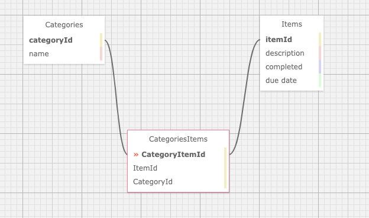

# To Do List with MVC Web Interface

#### Homework Practice Assignment during Epicodus Coding School, ASP.NET Core MVC & Many-to-Many Relationship Databases

#### By Danielle Thompson
#### Started 12.14.2020. Last updated 1.7.2021.

## Description

The app allows the user to add new items to a to do list. The user is also able to see a list of the tasks they have already added.

For example:

Program: Welcome to the To Do List.
Program: Would you like to add an item to your list or view your list? (Add/View)
User: Add
Program: Please enter the description for the new item.
User: Walk the dog.
Program: 'Walk the dog' has been added to your list. Would you like to add an item to your list or view your list? (Add/View)
User: View
Program: 1. Walk the dog.
Program: Would you like to add an item to your list or view your list? (Add/View)
Consider what the program should print if the user asks to view their list before they have added any items to it.



## Technologies used

- C# v 7.3
- .NET Core v 2.2
- dotnet script, REPL
- ASP.NET MVC Core
- Razor
- C# v 7.3
- .NET Core v 2.2
- MySQL, MySQL Workbench
- Entity Framework Core, CRUD, RESTful routing
- dotnet script, REPL
- ASP.NET MVC Core
- Razor
- [SQL Design Planner](https://ondras.zarovi.cz/sql/demo/)
- [Visual Code Studio](https://code.visualstudio.com/)

## Installation Requirements

#### Installing Git
###### For Mac Users

- Access Terminal in your Finder, and open a new window. Install the package manager, (Homebrew) [https://brew.sh/], on your device by entering this line of code in Terminal: `$ /usr/bin/ruby -e "$(curl -fsSL https://raw.githubusercontent.com/Homebrew/install/master/install)"`.
- Ensure Homebrew packages are run with this line of code: `echo 'export PATH=/usr/local/bin:$PATH' >> ~/.bash_profile`.
- Once homebrew is installed, install Git, a version control system for code writers, with this line of code `brew install git`.

###### For Windows Users

- Open a new Command Prompt window by typing "Cmd" in your computer's search bar.
- Determine whether you have 32-bit or 64-bit Windows by following these (instructions)[https://support.microsoft.com/en-us/help/13443/windows-which-version-am-i-running].
- Go to (Git Bash)[https://gitforwindows.org/], click on the "Download" button, and download the corresponding exe file from the Git for Windows site._
- Follow the instructions in the set up menu.

#### For Both Mac & Windows systems

- Once you have Git installed on your computer, go to this (GitHub repository)[https://github.com/dani-t-codes/ToDoList.Solution], click the "Fork" button in the upper right hand corner of the page, and clone this application with the following command:`git clone https://github.com/dani-t-codes/ToDoList.Solution.git`.


#### Installing C#, .NET, dotnet script, & MySQL

* Install C# and .Net according to your operating system below.

###### For Mac
 * Download this .NET Core SDK (Software Development Kit)[https://dotnet.microsoft.com/download/thank-you/dotnet-sdk-2.2.106-macos-x64-installer]. Clicking this link will prompt a .pkg file download from Microsoft.
* Open the .pkg file. This will launch an installer which will walk you through installation steps. Use the default settings the installer suggests.
* Confirm the installation is successful by opening your terminal and running the command $ dotnet --version, which should return something like: `2.2.105`.

###### For Windows (10+)
* Download either the the 64-bit .NET Core SDK (Software Development Kit)[https://dotnet.microsoft.com/download/thank-you/dotnet-sdk-2.2.203-windows-x64-installer]. Clicking these links will prompt a .exe file download from Microsoft.
* Open the file and follow the steps provided by the installer for your OS.
* Confirm the installation is successful by opening a new Windows PowerShell window and running the command dotnet --version. You should see something a response like this: `2.2.105`.

#### For Mac & Windows Operating Systems
* Install dotnet script with the following terminal command `dotnet tool install -g dotnet-script`.

#### Setting up a Local Database

- Download [MySQL Server](https://dev.mysql.com/downloads/file/?id=484914).
- Download [MySQL Workbench](https://dev.mysql.com/downloads/file/?id=484391).
- (For more detailed instructions if either of the above technologies are unfamiliar to you, visit [this site](https://www.learnhowtoprogram.com/c-and-net/getting-started-with-c/installing-and-configuring-mysql)).
- Run `dotnet build` when the project is on your local machine.
- Run `dotnet ef migrations add Initial`
  --> If there is an error stating "Unable to resolve project", this means the command wasn't run in the correct directory.
- Entity creates three files in the Migrations directory.
- Run the following command: `dotnet ef database update`.

#### MySQL Password Protection & .gitignore

Once the project has been cloned to your computer and you have all the necessary items on your local computer, open the project in the application of your choice.

Create a file in the root directory of the project called "appsettings.json". Add the following snippet of code to the appsettings.json file:

```
{
  "ConnectionStrings": {
    "DefaultConnection": "Server=localhost;Port=3306;database=registrar;uid=root;pwd=YOUR-PASSWORD-HERE;"
    }
}
```

Where you see "YOUR-PASSWORD-HERE" is where you put the password you created for your MySQL server. Your server name and port might vary depending on your local system. Check MySQL Workbench Connections to determine if the local host and port number match and adjust as needed.

Create a .gitignore file and add the following files & folders to it:

- obj/
- bin/
- .vscode/
- .DS_Store
- appsettings.json

#### Opening the Project on your Local System

* Navigate to the project folder on your Terminal or CMD.
* Run the command `code .` to open the folder in VS Code. Otherwise, find and open the project folder in the code editor of your choice.
* `dotnet build` will get bin/ and obj/ folders downloaded.
* `dotnet run` will run the application.
* `dotnet restore` to install packages listed in project's boilerplate.


### Specs

| Spec                                            | Input                        | Output                        |
| :---------------------------------------------- | :--------------------------- | :----------------------------|
| **Takes user To Do List item & adds to a list**    | User enters: "Walk the dog" | Return:  |


### Tests

Describe: listIt()
Test: listIt(userInput).toEqual(userOutput)
Expect: listIt("Walk the dog").toEqual("To Do List: Walk the Dog")


## Known bugs

No known bugs as of now. [Please report any bugs found here.](https://github.com/dani-t-codes/ToDoList.Solution/issues)

### Legal, or License

_MIT_ Copyright (c) 2020 *_Danielle Thompson_**